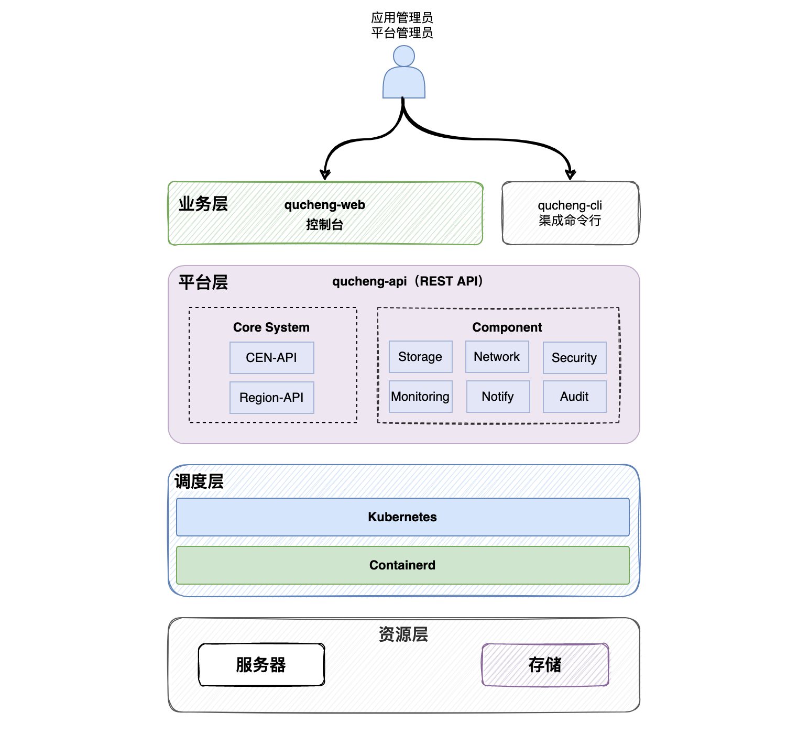

# 渠成企业管理软件百宝箱(QuickOn)

渠成企业管理软件百宝箱 简称 渠成百宝箱 是 北京渠成软件有限公司自主设计、研发的开源轻量级应用交付平台。通过渠成应用市场，您可以一键安装企业级软件，不仅具备高可用特性，还支持自动与手动备份，当有新版本发布时，您可以查看软件的更新日志，并决定是否升级。

渠成百宝箱底层基于容器和Kubernetes技术，通过Helm进行应用的封装，提供了渠成应用市场、服务管理、服务监控与告警、日志管理与审计、集群管理等平台功能，平台代码及应用镜像代码完全公开。

我们秉承Unix哲学，坚持用简单的方法来解决问题，因此平台在设计之初就坚持简单的原则，将底层复杂的技术进行了抽象和屏蔽，让使用者更专注于平台应用本身的体验，同时提供了应用的一键安装、升级、备份与回滚功能。渠成百宝箱，您可信赖的企业软件管理助手。

## 为什么用渠成这个名字？

**渠成：** 取自 “水到渠成” ，寓意“条件”具备后，后续的事情就会变得自然而然。“条件” 指的就是 “渠成百宝箱”，希望渠成百宝箱能为您的企业服务管理提供全方位的支持。

## 设计理念

目前开源和商业的平台软件很多，基本上都是基于容器和Kubernetes的生态实现，涵盖CMDB、自动化运维、CI、CD、GitOPS、DevOps等众多领域。但我们需要回归本心，认真思考我们要的是什么？平台的本质是什么？平台的真正用户是谁？

因此，经过我们的认真思考，来回答上面的几个问题：

- 平台的本质是什么？：平台只需要支撑业务服务就好，不需要过多的功能，因此我们只做应用安装与管理。
- 平台的用户是谁？：我们平台的用户是应用使用者，他们关注的是应用的稳定性，因此应用安装、升级、回滚备份是必要功能。
- "零" 负担起步：我们以降低用户使用门槛，减少用户学习成本为目标，这些思想贯穿于整个产品迭代周期。

渠成不做复杂的功能，我们的关注点在企业软件管理，我们要做企业软件管理的专家。

## 逻辑结构

### 业务层

业务层也称之为前台，承接功能的展现与业务层功能的实现，如用户管理、团队管理、平台管理、服务管理等，通过调用平台层接口实现对后端资源的控制与分配。
业务层使用PHP语言开发，通过zentaoPHP框架来实现，用户不需要关注如何安装业务层，平台命令行自动为您安装该服务。

源码目录：[frontend](./frontend)

### 命令行

负责渠成百宝箱快速安装、组件维护、状态查询。

源码地址：[quickon_cli](https://github.com/easysoft/quickon_cli)

### 平台层

平台层负责资源的抽象与整合、应用管理、监控告警、安全审计等功能，使用Golang语言开发。

源码目录：[backend](./backend)

### 调度层

调度层由Kubernetes（K3s）和容器引擎（Containerd）组成，Kubernetes负责容器的调度与管理，容器引擎负责维护容器的状态。

### 资源层

资源层是服务器和存储，支持虚拟化和分布式存储。渠成平台最少1台机器就可以运行，如果你有更多的服务器，平台支持集群扩容。

## 安装与使用

- [快速安装文档](https://www.qucheng.com/book/Installation-manual/quick-install-6.html)
- [使用文档](https://www.qucheng.com/book/Installation-manual/account-11.html)
- [命令行工具](https://www.qucheng.com/book/Installation-manual/cli-12.html)

## 主要功能列表

### 应用市场

> 提供官方的开源、商业软件，支持一键安装，数秒内就可以安装完成。

- 急速安装
- 自定义安装
- 应用发布

### 服务管理

> 软件从应用市场安装后，运行在平台上，我们称之为服务。

- 服务关闭、启动、重启、删除
- 服务访问控制
- 服务备份
- 服务升级
- 服务导出
- 自定义域名

### 高可用

> 平台组件、平台上运行的服务原生具备高可用特性。

- 内置K3s
- 对接现有Kubernetes
- 应用高可用
- 平台组件高可用

### 仪表盘

> 展示平台资源使用情况与服务运行情况，一个页面了解全局。

- 平台全局资源概况
- 平台动态信息
- 平台安装的应用详情

### 监控与告警

> 平台支持硬件资源、应用状态以及平台自身组件的状态监控与告警。

- 资源监控
- 组件监控
- 行为审计监控
- 应用指标监控
- 告警配置

### 安全审计

> 平台内置行为与安全审计模块，同时为运行在平台中的应用提供WAF安全防护功能。

- 平台行为审计
- Web应用防火墙
- 应用安全扫描

### 团队管理

> 提供团队创建、成员维护以及权限的配置。

- 成员管理
- 权限管理

### 集群管理

> 支持集群节点的维护、平台模块的监控与伸缩。

### 许可

[ZPL](http://zpl.pub/page/zplv12.html)或者[AGPL](https://www.gnu.org/licenses/agpl-3.0.en.html)
